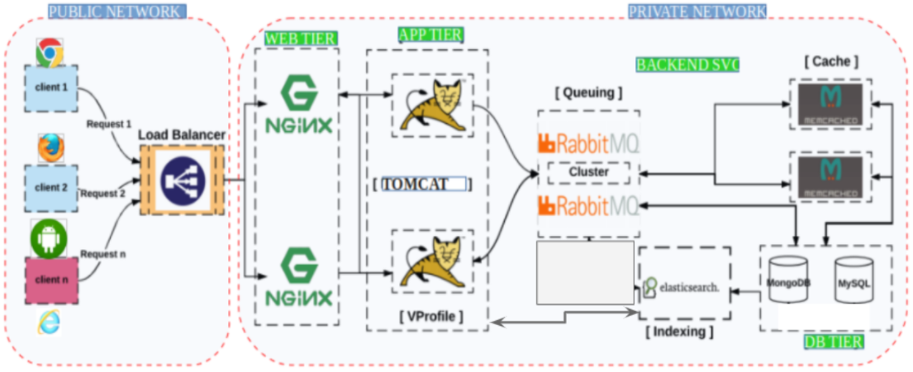

# Java-App-VagrantSetup

This project is automative creation of 5 Virtual Boxes with further installation and configuration servers on them.
For the sake of experiment there was chosen a Stack with:
* mysql database
* Memcache
* RabbitMQ
* Tomcat
* Nginx

The Stack looks like this:

